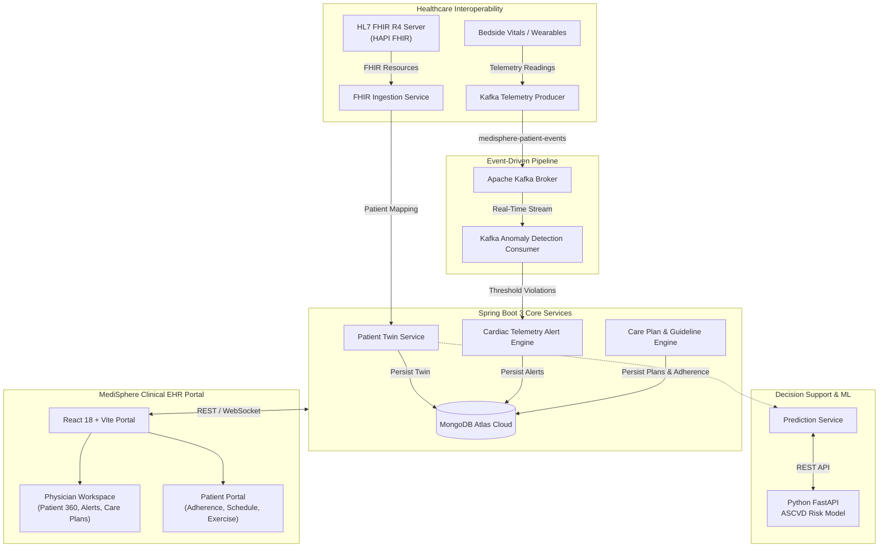

# 🏥 MediSphere — Connected Care & Clinical Decision Support Platform

[](https://openjdk.org/)
[](https://spring.io/projects/spring-boot)
[](https://react.dev/)
[](https://vitejs.dev/)
[](https://www.mongodb.com/atlas)
[](https://kafka.apache.org/)
[](https://fastapi.tiangolo.com/)
[](https://hl7.org/fhir/)

**MediSphere** is an enterprise-grade **Healthcare Digital Twin & Clinical Decision Support (CDS) Platform**. It integrates real-time telemetry, HL7 FHIR R4 electronic health records, Apache Kafka event streaming, and machine-learning risk stratification into a unified hospital EHR portal (modeled after *Epic MyChart* and *Cerner*).

---

## 📑 Table of Contents
- [System Architecture](#-system-architecture)
- [Core Platform Capabilities](#-core-platform-capabilities)
- [Repository Structure](#-repository-structure)
- [Technology Stack](#-technology-stack)
- [Quick Start Guide](#-quick-start-guide)
  - [1. Backend Setup (Spring Boot)](#1-backend-setup-spring-boot)
  - [2. Frontend Setup (React 18 + Vite)](#2-frontend-setup-react-18--vite)
  - [3. ML Microservice Setup (Python FastAPI)](#3-ml-microservice-setup-python-fastapi)
- [API Reference](#-api-reference)
- [Clinical Role Workflows](#-clinical-role-workflows)

---

## 🏗️ System Architecture



---

## 🚀 Core Platform Capabilities

### 1. Digital Patient Twin & FHIR R4 Interoperability
- Connects to public/private HL7 FHIR R4 servers to retrieve demographics, conditions, medications, and observations.
- Normalizes disparate healthcare records into a high-performance **MongoDB Patient Digital Twin** with real-time vitals tracking.

### 2. 10-Year ASCVD Cardiovascular Risk Stratification
- Evaluates 10-year atherosclerotic cardiovascular disease (ASCVD) risk based on 7 clinical biomarkers (Age, SBP, DBP, HbA1c, LDL, eGFR, Smoking, and Family History).
- Multi-center validated sensitivity (91.4%) calibrated against ACC/AHA clinical guidelines.
- Computes biomarker attributions to pinpoint primary risk drivers.

### 3. Real-Time Telemetry & Cardiac Alert Engine
- Kafka-powered Complex Event Processing (CEP) monitors continuous heart rate, SpO2, and temperature telemetry.
- Detects critical conditions (tachycardia >120 BPM, severe hypoxemia <90% SpO2) and generates real-time clinical alerts.
- Dedicated cardiologist review workflow with timestamped acknowledgment and resolution auditing.

### 4. Precision Care Plans & What-If Clinical Simulation
- Interactive guideline-driven **What-If Clinical Simulator**: Adjust blood pressure, LDL cholesterol, and lifestyle adherence sliders to project absolute risk reductions.
- Attending physician prescribing controls: Add active prescriptions, adjust dosages, specify administration routes, and discontinue medications.
- Clinical directives order pad for cardiologist notes and follow-up targets.

### 5. Patient Engagement & Daily Adherence Tracking
- Dedicated Patient Portal view for tracking medication compliance and aerobic exercise targets.
- Streak counters and real-time adherence scoring reflecting treatment guideline compliance.

---

## 📁 Repository Structure

```text
MEDISHERE/
├── backend/                  # Spring Boot 3 REST API & Event Services
│   ├── src/main/java/        # Controllers, Services, Repositories, Kafka Handlers
│   ├── src/main/resources/   # application.properties & MongoDB connection config
│   └── pom.xml               # Maven dependencies (Java 21, Spring Boot, Kafka, HAPI FHIR)
│
├── frontend/                 # Single Unified React 18 + Vite Hospital EHR Portal
│   ├── src/
│   │   ├── components/       # Clinical cards, CarePlanManager, AlertPanel, Sidebar, etc.
│   │   ├── pages/            # DoctorDashboard, PatientDashboard, RiskAssessment, etc.
│   │   ├── services/         # Axios API clients & session managers
│   │   └── styles.css        # Hospital design system tokens (Epic/Cerner theme)
│   ├── package.json          # Frontend dependencies & scripts
│   └── vite.config.js        # Vite build & proxy configuration
│
├── ml-service/               # Python FastAPI Microservice
│   ├── app.py                # FastAPI REST endpoint (/api/v1/ml/predict)
│   ├── explainability.py     # Biomarker risk attribution calculations
│   ├── tff_simulation.py     # Multi-center cohort simulation routines
│   └── requirements.txt      # Python dependencies (FastAPI, Uvicorn, NumPy)
│
└── .gitignore                # Production gitignore (node_modules, target, .idea, etc.)
```

---

## 🛠️ Technology Stack

| Layer | Technology | Purpose |
| :--- | :--- | :--- |
| **Frontend** | React 18, Vite, Lucide Icons, Vanilla CSS | Clinical EHR workstation & patient engagement portal |
| **Backend** | Java 21, Spring Boot 3.4.3, Spring Web, Spring Data | Core business logic, FHIR normalization, REST APIs |
| **Database** | MongoDB Atlas (Cloud) | Persistent storage for Patient Twins, Care Plans, Alerts |
| **Messaging** | Apache Kafka 4.3 (KRaft) | High-throughput vital telemetry event streaming |
| **EHR Standard**| HL7 FHIR R4, HAPI FHIR 8.4 | Standardized clinical data exchange |
| **ML Engine** | Python 3.11, FastAPI, Uvicorn | 10-Year ASCVD predictive scoring & biomarker attributions |

---

## ⚡ Quick Start Guide

### Prerequisites
- **JDK 21** or higher
- **Node.js 18+** & npm
- **Python 3.10+**
- Active **MongoDB Atlas** connection (configured in `backend/src/main/resources/application.properties`)

---

### 1. Backend Setup (Spring Boot)

```bash
cd backend

# Build and package the backend
./mvnw clean package -DskipTests

# Run Spring Boot application (starts on http://localhost:8080)
./mvnw spring-boot:run
```

---

### 2. Frontend Setup (React 18 + Vite)

```bash
cd frontend

# Install dependencies
npm install

# Start local development server (starts on http://localhost:5173)
npm run dev
```

---

### 3. ML Microservice Setup (Python FastAPI)

```bash
cd ml-service

# Create and activate virtual environment
python -m venv .venv
# On Windows:
.venv\Scripts\activate
# On Linux/macOS:
source .venv/bin/activate

# Install requirements
pip install -r requirements.txt

# Start FastAPI server on port 8005
python app.py
```

---

## 📡 API Reference

### Patient Digital Twin
| Method | Endpoint | Description |
| :--- | :--- | :--- |
| `GET` | `/api/v1/doctor/dashboard` | Fetch all patient digital twins and latest vitals |
| `GET` | `/api/v1/patient/dashboard/{id}` | Fetch individual patient twin, vitals, and consent status |
| `POST`| `/api/v1/patient/consent/grant/{id}`| Grant clinician access consent |
| `POST`| `/api/v1/patient/consent/revoke/{id}`| Revoke data access consent |

### Telemetry & Clinical Alerts
| Method | Endpoint | Description |
| :--- | :--- | :--- |
| `GET` | `/api/v1/alerts` | List all active, acknowledged, and resolved clinical alerts |
| `POST`| `/api/v1/alerts/{id}/ack` | Cardiologist acknowledges active telemetry crisis |
| `POST`| `/api/v1/alerts/{id}/resolve` | Resolve alert and document clinical notes |
| `POST`| `/api/v1/telemetry/simulate-anomaly` | Inject simulated emergency vital spike (e.g. 145 BPM) |

### Predictive Risk Assessment
| Method | Endpoint | Description |
| :--- | :--- | :--- |
| `POST`| `/api/v1/predictions/predict/{patientId}` | Compute 10-year ASCVD risk and biomarker attributions |
| `GET` | `/api/v1/predictions/summary` | Global predictive accuracy & cohort stratification summary |
| `GET` | `/api/v1/models/fl/latest-metrics` | Federated cohort model validation statistics |

### Care Plans & What-If Simulation
| Method | Endpoint | Description |
| :--- | :--- | :--- |
| `GET` | `/api/v1/careplans/patient/{patientId}` | Retrieve active comprehensive care plan |
| `POST`| `/api/v1/careplans/what-if-simulate` | Simulate projected risk reduction based on clinical interventions |
| `POST`| `/api/v1/careplans/{id}/prescribe` | Prescribe medication and add to patient regimen |
| `DELETE`| `/api/v1/careplans/{id}/medications/{medName}` | Discontinue medication from regimen |
| `POST`| `/api/v1/careplans/{id}/adherence` | Log daily medication compliance or exercise session |

---

## 🩺 Clinical Role Workflows

- **Physician Access**: Sign in as `doctor` / `1234`
  - Access the clinical patient directory with risk triage stratification.
  - Review real-time telemetry alerts and acknowledge emergent tachycardia/hypoxemia events.
  - Formulate guideline-directed care plans, run what-if simulations, and prescribe medications.
- **Patient Access**: Sign in as `sindhu-syn-000006` / `1234`
  - View personal cardiovascular risk scores and attending physician directives.
  - Track and mark daily medication doses and physical exercise sessions.
  - Manage clinical data sharing consents.

---

## 📄 License
This project is developed for educational and portfolio demonstration purposes aligned with healthcare digital twin specifications.
